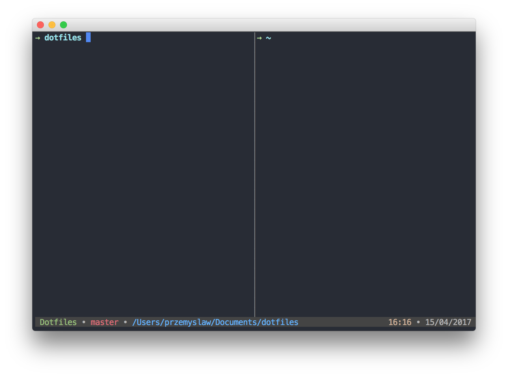

# Dotfiles

My MacOS terminal, Tmux and ZSH configuration.

## Installation
1. Clone repository `git clone https://github.com/phardyn/dotfiles.git`
2. Install terminal theme from the file `phardyn.terminal`
3. Run `setup.sh` to install and configure dependencies

## Key bindings
- Panes
  - `Ctrl + k 3` - split screen vertically
  - `Ctrl + k 2` - split screen horizontally
  - `Ctrl + k 0` - close current pane
  - `Ctrl + k o` - switch to next pane
  - `Ctrl + V` - equally balance panes vertically
  - `Ctrl + H` - equally balance panes horizontally

- Sessions
  - `Ctrl + k n` - open new session
  - `Ctrl + k $` - change session name
  - `Ctrl + k x` - kill the current session
  - `Ctrl + k X` - kill all sessions except the current one

- Other
  - `Ctrl + k :` - enter command
  - `Ctrl + k r` - reload the Tmux configuration file
  - `Ctrl + k S` - save current setup with tmux-resurrect
  - `Ctrl + k R` - restore saved setup with tmux-resurrect
  - `Ctrl + k m` - enable/disable mouse mode (scrolling, switching panes etc.)

## Credits
A lot of functionality and inspiration comes from [this](https://github.com/ice9js/dragons) config by [ice9js](https://github.com/ice9js).
